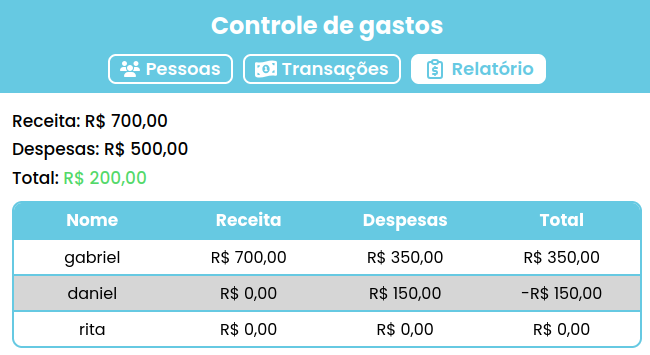
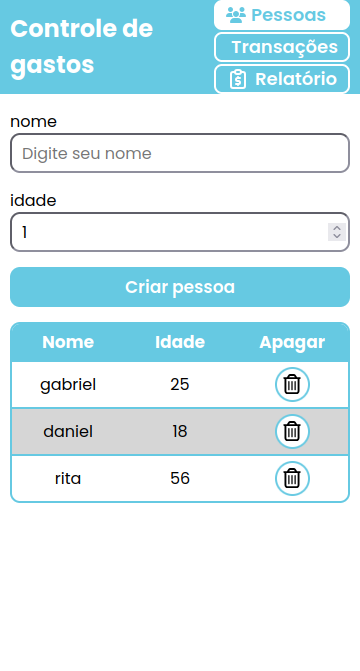
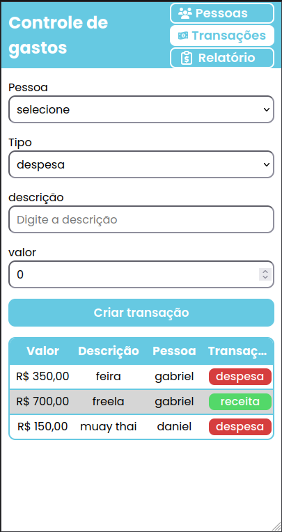

# ExpensesControl

Front-end do sistema de controle de gastos residenciais, desenvolvido como
desafio técnico de estágio em TI (Desenvolvimento). Consome a API
[expenses-control-back](https://github.com/gaesyeah/expenses-control-back)
para cadastro de pessoas, transações financeiras e consulta de totais.

<p align="center">
  
</p>
<p align="center">
  
  
</p>

## Sobre as decisões técnicas deste projeto

Este é um projeto simples, e a maior parte das decisões abaixo não seriam necessarias para o seu escopo (em outras palavras, matei uma formiga com uma bazuca). Optei, no entanto, por aplicar algumas práticas mais avançadas de propósito, como o uso de **generics** para construir um hook e componentes mais reaproveitáveis (especialmente `Input`, `Select` e seus usos em formulários tipados), para demonstrar o tipo de arquitetura que eu adotaria em um sistema real de grande porte, onde esse nível de reuso e segurança de tipos se paga rapidamente.

## Tecnologias

- **React 19** + **TypeScript**
- **Vite** como build tool
- **React Router** para navegação entre telas
- **TanStack Query** para cache, loading e revalidação de dados da API
- **Axios** para requisições HTTP
- **styled-components** para estilização, com tema tipado
- **SweetAlert2** para confirmações e alertas
- **react-toastify** para notificações de sucesso/erro
- **react-icons** e **react-loader-spinner** para ícones e indicadores de carregamento

## Pré-requisitos

- [Node.js](https://nodejs.org/) (versão 20 ou superior recomendada)
- Opcionalmente, o back-end rodando localmente para desenvolvimento, veja as
  instruções em [expenses-control-back](https://github.com/gaesyeah/expenses-control-back)

## Como rodar o projeto

1. Clone o repositório:

   ```bash
   git clone https://github.com/gaesyeah/expenses-control-front.git
   cd expenses-control-front
   ```

2. Instale as dependências:

   ```bash
   npm install
   ```

3. Configure as variáveis de ambiente:

   Renomeie o arquivo `.env.example` para `.env` e escolha a URL da API de
   acordo com o ambiente:

   ```bash
   # VITE_API_URL=https://expenses-control-api.onrender.com
   VITE_API_URL=http://localhost:5228
   ```

4. Rode a aplicação:

   ```bash
   npm run dev
   ```

## Testando localmente com o back-end

Para testar o front-end contra a API local, é necessário que o back-end esteja
em execução. Siga as instruções de setup em
[expenses-control-back](https://github.com/gaesyeah/expenses-control-back)
para clonar, configurar e iniciar a API.

## Sobre o back-end

O back-end utiliza **PostgreSQL**.

Em desenvolvimento, o banco é executado em um container Docker, com persistência
em um volume Docker.

A versão publicada da API está hospedada no plano gratuito do Render. Caso o
serviço permaneça inativo por algum tempo, o primeiro acesso pode levar cerca de
1 minuto (cold start).

## Deploy

O front-end está publicado em:

```
https://expenses-control-front.vercel.app/
```
